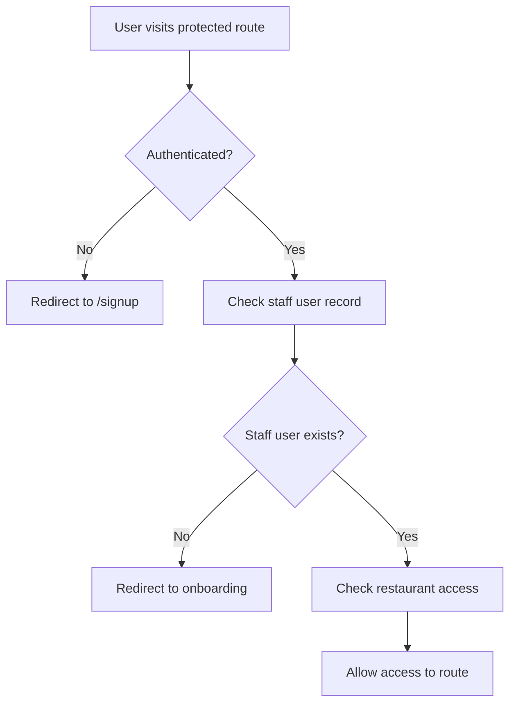

# QR Orders - Authentication & Authorization Documentation

## Overview

The QR Orders application uses Clerk for authentication and implements a role-based access control (RBAC) system with multi-tenant data isolation. This document covers the authentication flows, authorization patterns, and security considerations.

## Authentication Architecture

### Clerk Integration

Clerk handles all user authentication, providing:
- User registration and login
- Session management
- Social OAuth (Google, etc.)
- Multi-factor authentication
- User profile management

### Authentication Flow



## User Types and Roles

### Customer Users
- **No authentication required** for ordering
- Access public ordering interface via QR codes
- No user accounts or profiles stored

### Staff Users
- **Authenticated via Clerk**
- Linked to specific restaurants
- Role-based permissions within restaurant

### Staff Roles

#### Owner
- **Full access** to all restaurant features
- Can manage other staff users
- Access to billing and subscription management
- Can delete restaurant account

**Permissions**:
- ✅ View and manage all orders
- ✅ Manage menu items and categories
- ✅ Generate QR codes
- ✅ Manage restaurant settings
- ✅ Manage staff users
- ✅ Access billing and payments
- ✅ View analytics and reports

#### Manager
- **Management access** to operations
- Cannot manage billing or other staff
- Focus on day-to-day operations

**Permissions**:
- ✅ View and manage all orders
- ✅ Manage menu items and categories
- ✅ Generate QR codes
- ✅ Manage restaurant settings
- ❌ Manage staff users
- ❌ Access billing and payments
- ✅ View analytics and reports

#### Staff
- **Limited access** to order management
- Cannot modify restaurant settings
- Focus on order fulfillment

**Permissions**:
- ✅ View and manage orders
- ✅ Toggle menu item availability
- ❌ Manage menu categories
- ❌ Generate QR codes
- ❌ Manage restaurant settings
- ❌ Manage staff users
- ❌ Access billing and payments
- ❌ View analytics and reports

## Implementation Details

### Authentication Middleware

**File**: `src/middleware.ts`

```typescript
import { NextResponse } from 'next/server'

export default function middleware(req: any) {
  // Check if Clerk is configured
  const clerkPublishableKey = process.env.NEXT_PUBLIC_CLERK_PUBLISHABLE_KEY
  const clerkSecretKey = process.env.CLERK_SECRET_KEY
  
  if (!clerkPublishableKey || !clerkSecretKey || 
      clerkPublishableKey.includes('placeholder') || 
      clerkSecretKey.includes('placeholder')) {
    return NextResponse.next()
  }

  // Define public routes
  const isPublicRoute = createRouteMatcher([
    '/',
    '/about',
    '/contact', 
    '/pricing',
    '/signup',
    '/dashboard',
    '/qr-test',
    '/qr-display',
    '/r/(.*)',
    '/order/(.*)',
    '/api/stripe/webhook',
  ])

  return clerkMiddleware((auth: any) => {
    if (!isPublicRoute(req)) {
      const { userId } = auth()
      if (!userId) {
        return NextResponse.redirect(new URL('/signup', req.url))
      }
    }
  })(req)
}
```

### Staff User Management

**File**: `src/lib/auth.ts`

```typescript
import { auth } from '@clerk/nextjs/server'
import { db } from './db'

export async function getCurrentStaffUser() {
  try {
    const { userId } = await auth()
    if (!userId) return null

    const staffUser = await db.staffUser.findFirst({
      where: { clerkUserId: userId },
      include: { 
        restaurant: {
          include: {
            staffUsers: true,
          }
        }
      },
    })

    return staffUser
  } catch (error) {
    console.error('Error getting current staff user:', error)
    return null
  }
}

export async function requireStaffUser() {
  const staffUser = await getCurrentStaffUser()
  if (!staffUser) {
    throw new Error('Authentication required')
  }
  return staffUser
}

export async function requireRestaurant() {
  const staffUser = await requireStaffUser()
  return staffUser.restaurant
}

export async function requireRole(requiredRole: StaffRole) {
  const staffUser = await requireStaffUser()
  
  const roleHierarchy = {
    STAFF: 1,
    MANAGER: 2,
    OWNER: 3
  }
  
  if (roleHierarchy[staffUser.role] < roleHierarchy[requiredRole]) {
    throw new Error('Insufficient permissions')
  }
  
  return staffUser
}
```

### Route Protection

#### Page-Level Protection

**Example**: `src/app/admin/menu/page.tsx`

```typescript
import { getCurrentStaffUser } from '@/lib/auth'
import { redirect } from 'next/navigation'

export default async function AdminMenuPage() {
  const staffUser = await getCurrentStaffUser()

  if (!staffUser) {
    redirect('/signup')
  }

  if (staffUser.role === 'STAFF') {
    redirect('/dashboard')
  }

  return (
    <div>
      <MenuManagement restaurantId={staffUser.restaurantId} />
    </div>
  )
}
```

#### API Route Protection

**Example**: `src/app/api/menu/route.ts`

```typescript
import { requireStaffUser } from '@/lib/auth'

export async function GET(request: NextRequest) {
  try {
    const staffUser = await requireStaffUser()
    const { searchParams } = new URL(request.url)
    const restaurantId = searchParams.get('restaurantId')

    // Verify restaurant access
    if (!restaurantId || staffUser.restaurantId !== restaurantId) {
      return NextResponse.json(
        { error: 'Unauthorized' },
        { status: 403 }
      )
    }

    // Fetch menu data...
  } catch (error) {
    return NextResponse.json(
      { error: 'Authentication required' },
      { status: 401 }
    )
  }
}
```

## Multi-Tenant Data Isolation

### Restaurant Scoping

All database queries must be scoped by `restaurantId` to ensure data isolation:

```typescript
// ✅ Correct: Scoped query
const orders = await db.order.findMany({
  where: { 
    restaurantId: staffUser.restaurantId 
  }
})

// ❌ Incorrect: Unscoped query (security risk)
const orders = await db.order.findMany()
```

### Middleware Enforcement

The application middleware ensures all API routes are properly scoped:

```typescript
// Example: Order API route
export async function GET(request: NextRequest) {
  const staffUser = await requireStaffUser()
  const { searchParams } = new URL(request.url)
  const restaurantId = searchParams.get('restaurantId')

  // Enforce restaurant scoping
  if (!restaurantId || staffUser.restaurantId !== restaurantId) {
    return NextResponse.json(
      { error: 'Unauthorized' },
      { status: 403 }
    )
  }

  // Proceed with scoped query
  const orders = await db.order.findMany({
    where: { restaurantId: staffUser.restaurantId }
  })
}
```

## User Registration and Onboarding

### Staff User Creation

When a new user signs up via Clerk, they need to be linked to a restaurant:

```typescript
// API route: /api/staff/create
export async function POST(request: NextRequest) {
  try {
    const { restaurantId, role } = await request.json()
    const { userId } = await auth()

    if (!userId) {
      return NextResponse.json(
        { error: 'Authentication required' },
        { status: 401 }
      )
    }

    // Check if user already exists
    const existingUser = await db.staffUser.findFirst({
      where: { clerkUserId: userId }
    })

    if (existingUser) {
      return NextResponse.json(
        { error: 'User already exists' },
        { status: 400 }
      )
    }

    // Create staff user record
    const staffUser = await db.staffUser.create({
      data: {
        restaurantId,
        clerkUserId: userId,
        role: role || 'STAFF'
      }
    })

    return NextResponse.json({ success: true, staffUser })
  } catch (error) {
    return NextResponse.json(
      { error: 'Failed to create staff user' },
      { status: 500 }
    )
  }
}
```

### Restaurant Onboarding

The onboarding process creates both restaurant and staff user records:

```typescript
// API route: /api/onboarding/business
export async function POST(request: NextRequest) {
  try {
    const { userId } = await auth()
    if (!userId) {
      return NextResponse.json(
        { error: 'Authentication required' },
        { status: 401 }
      )
    }

    const businessData = await request.json()

    // Create restaurant
    const restaurant = await db.restaurant.create({
      data: {
        ...businessData,
        slug: generateSlug(businessData.name)
      }
    })

    // Create staff user as owner
    const staffUser = await db.staffUser.create({
      data: {
        restaurantId: restaurant.id,
        clerkUserId: userId,
        role: 'OWNER'
      }
    })

    return NextResponse.json({ 
      success: true, 
      restaurant,
      staffUser 
    })
  } catch (error) {
    return NextResponse.json(
      { error: 'Failed to create restaurant' },
      { status: 500 }
    )
  }
}
```

## Session Management

### Clerk Session Handling

Clerk automatically manages JWT tokens and session refresh:

```typescript
// Get current user from Clerk
import { currentUser } from '@clerk/nextjs/server'

export async function getCurrentUser() {
  try {
    const user = await currentUser()
    return user
  } catch (error) {
    console.error('Error getting current user:', error)
    return null
  }
}
```

### Session Validation

```typescript
// Validate session in API routes
export async function validateSession() {
  const { userId } = await auth()
  
  if (!userId) {
    throw new Error('Session expired')
  }
  
  return userId
}
```

## Authorization Patterns

### Role-Based Access Control

```typescript
// Check if user has required role
export async function hasRole(requiredRole: StaffRole) {
  const staffUser = await getCurrentStaffUser()
  if (!staffUser) return false

  const roleHierarchy = {
    STAFF: 1,
    MANAGER: 2,
    OWNER: 3
  }

  return roleHierarchy[staffUser.role] >= roleHierarchy[requiredRole]
}

// Usage in components
const canManageMenu = await hasRole('MANAGER')
const canAccessBilling = await hasRole('OWNER')
```

### Resource-Based Authorization

```typescript
// Check if user can access specific resource
export async function canAccessOrder(orderId: string) {
  const staffUser = await getCurrentStaffUser()
  if (!staffUser) return false

  const order = await db.order.findFirst({
    where: {
      id: orderId,
      restaurantId: staffUser.restaurantId
    }
  })

  return !!order
}
```

### Permission Helpers

```typescript
// Permission checking utilities
export const permissions = {
  canManageOrders: (role: StaffRole) => ['STAFF', 'MANAGER', 'OWNER'].includes(role),
  canManageMenu: (role: StaffRole) => ['MANAGER', 'OWNER'].includes(role),
  canManageStaff: (role: StaffRole) => role === 'OWNER',
  canAccessBilling: (role: StaffRole) => role === 'OWNER',
  canGenerateQR: (role: StaffRole) => ['MANAGER', 'OWNER'].includes(role),
}
```

## Security Considerations

### Input Validation

All user inputs are validated using Zod schemas:

```typescript
import { z } from 'zod'

const createOrderSchema = z.object({
  restaurantId: z.string().cuid(),
  tableId: z.string().cuid().optional(),
  items: z.array(z.object({
    menuItemId: z.string().cuid(),
    qty: z.number().min(1),
    unitPriceCents: z.number().min(0),
    notes: z.string().optional(),
    modifiers: z.array(z.any()).optional()
  }))
})

export async function POST(request: NextRequest) {
  try {
    const body = await request.json()
    const validatedData = createOrderSchema.parse(body)
    // Process validated data...
  } catch (error) {
    if (error instanceof z.ZodError) {
      return NextResponse.json(
        { error: 'Invalid data', details: error.errors },
        { status: 400 }
      )
    }
    // Handle other errors...
  }
}
```

### SQL Injection Prevention

Prisma ORM automatically prevents SQL injection:

```typescript
// ✅ Safe: Prisma handles parameterization
const orders = await db.order.findMany({
  where: {
    restaurantId: staffUser.restaurantId,
    status: 'PAID'
  }
})

// ❌ Dangerous: Raw SQL with user input
const orders = await db.$queryRaw`
  SELECT * FROM orders WHERE restaurant_id = '${restaurantId}'
`
```

### CSRF Protection

Next.js provides built-in CSRF protection for API routes:

```typescript
// CSRF token validation
export async function POST(request: NextRequest) {
  const csrfToken = request.headers.get('x-csrf-token')
  const sessionToken = request.cookies.get('__session')?.value

  if (!csrfToken || !sessionToken) {
    return NextResponse.json(
      { error: 'CSRF token required' },
      { status: 403 }
    )
  }

  // Validate CSRF token...
}
```

## Error Handling

### Authentication Errors

```typescript
// Standardized error responses
export class AuthenticationError extends Error {
  constructor(message: string) {
    super(message)
    this.name = 'AuthenticationError'
  }
}

export class AuthorizationError extends Error {
  constructor(message: string) {
    super(message)
    this.name = 'AuthorizationError'
  }
}

// Error handling in API routes
export async function GET(request: NextRequest) {
  try {
    const staffUser = await requireStaffUser()
    // Process request...
  } catch (error) {
    if (error instanceof AuthenticationError) {
      return NextResponse.json(
        { error: 'Authentication required' },
        { status: 401 }
      )
    }
    
    if (error instanceof AuthorizationError) {
      return NextResponse.json(
        { error: 'Insufficient permissions' },
        { status: 403 }
      )
    }
    
    return NextResponse.json(
      { error: 'Internal server error' },
      { status: 500 }
    )
  }
}
```

## Testing Authentication

### Unit Tests

```typescript
// Test authentication helpers
describe('Authentication', () => {
  it('should require authentication for protected routes', async () => {
    const response = await fetch('/api/orders', {
      headers: { 'Authorization': 'Bearer invalid-token' }
    })
    
    expect(response.status).toBe(401)
  })

  it('should enforce role-based access', async () => {
    const staffUser = { role: 'STAFF' }
    const canAccessBilling = permissions.canAccessBilling(staffUser.role)
    
    expect(canAccessBilling).toBe(false)
  })
})
```

### Integration Tests

```typescript
// Test complete authentication flow
describe('Authentication Flow', () => {
  it('should create staff user during onboarding', async () => {
    const response = await fetch('/api/onboarding/business', {
      method: 'POST',
      headers: {
        'Authorization': `Bearer ${validToken}`,
        'Content-Type': 'application/json'
      },
      body: JSON.stringify({
        name: 'Test Restaurant',
        address: '123 Test St'
      })
    })

    const data = await response.json()
    expect(data.success).toBe(true)
    expect(data.staffUser.role).toBe('OWNER')
  })
})
```

## Monitoring and Auditing

### Authentication Logging

```typescript
// Log authentication events
export async function logAuthEvent(event: string, userId: string, details?: any) {
  console.log('Auth Event:', {
    event,
    userId,
    timestamp: new Date().toISOString(),
    details
  })
  
  // Send to monitoring service
  await sendToMonitoring({
    type: 'auth_event',
    event,
    userId,
    details
  })
}

// Usage
await logAuthEvent('login', userId)
await logAuthEvent('role_change', userId, { oldRole: 'STAFF', newRole: 'MANAGER' })
```

### Security Monitoring

```typescript
// Monitor for suspicious activity
export async function checkSuspiciousActivity(userId: string, action: string) {
  const recentActions = await getRecentUserActions(userId, 5) // Last 5 minutes
  
  if (recentActions.length > 10) {
    await logAuthEvent('suspicious_activity', userId, {
      action,
      recentActions: recentActions.length
    })
    
    // Alert security team
    await sendSecurityAlert(userId, 'High frequency of actions')
  }
}
```

This authentication documentation provides comprehensive guidance for implementing and maintaining secure authentication and authorization in the QR Orders application.
