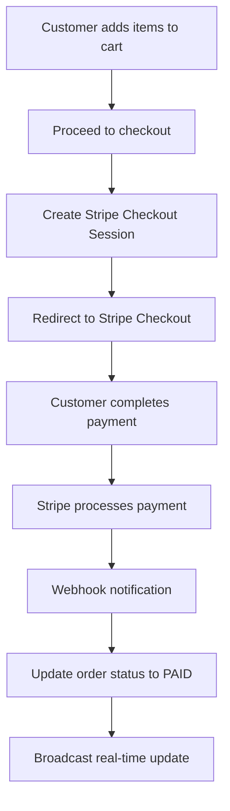

# QR Orders - Payment Integration Documentation

## Overview

The QR Orders application uses Stripe Connect Standard for payment processing, enabling restaurants to receive payments directly to their Stripe accounts. This document covers the payment flow, Stripe integration, webhook handling, and billing management.

## Payment Architecture

### Stripe Connect Standard

The application uses Stripe Connect Standard to enable:
- **Direct Charges**: Payments go directly to restaurant accounts
- **Platform Fees**: Optional platform fees (configurable)
- **Multi-party Payments**: Support for multiple restaurants
- **Express Accounts**: Simplified onboarding for restaurants

### Payment Flow



## Stripe Configuration

### Environment Variables

```env
# Stripe API Keys
STRIPE_SECRET_KEY="sk_test_..." # or sk_live_... for production
STRIPE_PUBLISHABLE_KEY="pk_test_..." # or pk_live_... for production

# Webhook Configuration
STRIPE_WEBHOOK_SECRET="whsec_..."

# Connect Configuration
STRIPE_CONNECT_RETURN_URL="https://your-domain.com/admin/settings"
STRIPE_CONNECT_REFRESH_URL="https://your-domain.com/admin/settings"

# Billing Configuration
STRIPE_PRICE_ID_MVP_STANDARD="price_xxx"
STRIPE_BILLING_PORTAL_RETURN_URL="https://your-domain.com/admin/billing"

# Platform Fees (optional)
PLATFORM_FEE_BPS=0 # Basis points (0 = 0%)
PLATFORM_FEE_FIXED_CENTS=0 # Fixed fee in cents
```

### Stripe Client Setup

**File**: `src/lib/stripe.ts`

```typescript
import Stripe from 'stripe'

export const stripe = new Stripe(process.env.STRIPE_SECRET_KEY!, {
  apiVersion: '2024-12-18.acacia',
  typescript: true,
})

// Platform fee calculation
export function calculatePlatformFee(amountCents: number): number {
  const bps = parseInt(process.env.PLATFORM_FEE_BPS || '0')
  const fixed = parseInt(process.env.PLATFORM_FEE_FIXED_CENTS || '0')
  
  return Math.round((amountCents * bps) / 10000) + fixed
}
```

## Restaurant Onboarding

### Stripe Connect Account Creation

**API Route**: `/api/connect/create-account`

```typescript
export async function POST(request: NextRequest) {
  try {
    const restaurant = await requireRestaurant()
    
    if (restaurant.stripeAccountId) {
      return NextResponse.json(
        { error: 'Stripe account already connected' },
        { status: 400 }
      )
    }

    const { searchParams } = new URL(request.url)
    const email = searchParams.get('email') || 'restaurant@example.com'

    // Create Stripe Connect account
    const account = await stripe.accounts.create({
      type: 'express',
      country: 'US',
      email: email,
      capabilities: {
        card_payments: { requested: true },
        transfers: { requested: true },
      },
      business_type: 'restaurant',
      business_profile: {
        name: restaurant.name,
        url: `https://your-domain.com/r/${restaurant.slug}`,
        mcc: '5812', // Restaurants
      },
    })

    // Update restaurant with Stripe account ID
    await db.restaurant.update({
      where: { id: restaurant.id },
      data: { stripeAccountId: account.id },
    })

    // Create account link for onboarding
    const accountLink = await stripe.accountLinks.create({
      account: account.id,
      return_url: process.env.STRIPE_CONNECT_RETURN_URL!,
      refresh_url: process.env.STRIPE_CONNECT_REFRESH_URL!,
      type: 'account_onboarding',
    })

    return NextResponse.json({
      success: true,
      url: accountLink.url,
    })
  } catch (error) {
    console.error('Error creating Stripe account:', error)
    return NextResponse.json(
      { error: 'Failed to create Stripe account' },
      { status: 500 }
    )
  }
}
```

### Account Status Checking

**API Route**: `/api/connect/account-status`

```typescript
export async function GET(request: NextRequest) {
  try {
    const restaurant = await requireRestaurant()
    
    if (!restaurant.stripeAccountId) {
      return NextResponse.json(
        { error: 'No Stripe account connected' },
        { status: 400 }
      )
    }

    const account = await stripe.accounts.retrieve(restaurant.stripeAccountId)
    
    // Update restaurant status
    await db.restaurant.update({
      where: { id: restaurant.id },
      data: {
        chargesEnabled: account.charges_enabled,
        payoutsEnabled: account.payouts_enabled,
      },
    })

    return NextResponse.json({
      accountId: account.id,
      chargesEnabled: account.charges_enabled,
      payoutsEnabled: account.payouts_enabled,
      detailsSubmitted: account.details_submitted,
      requirements: {
        currentlyDue: account.requirements?.currently_due || [],
        eventuallyDue: account.requirements?.eventually_due || [],
        pastDue: account.requirements?.past_due || [],
      },
    })
  } catch (error) {
    console.error('Error checking account status:', error)
    return NextResponse.json(
      { error: 'Failed to check account status' },
      { status: 500 }
    )
  }
}
```

## Payment Processing

### Checkout Session Creation

**API Route**: `/api/checkout`

```typescript
export async function POST(request: NextRequest) {
  try {
    const {
      restaurantId,
      tableId,
      items,
      customerEmail,
      notes,
    } = await request.json()

    // Validate restaurant and get Stripe account
    const restaurant = await db.restaurant.findUnique({
      where: { id: restaurantId },
    })

    if (!restaurant || !restaurant.stripeAccountId) {
      return NextResponse.json(
        { error: 'Restaurant not found or Stripe not connected' },
        { status: 400 }
      )
    }

    // Calculate total
    const totalCents = items.reduce((sum: number, item: any) => {
      const itemTotal = item.unitPriceCents * item.qty
      const modifierTotal = (item.modifiers || []).reduce(
        (modSum: number, mod: any) => modSum + (mod.priceDeltaCents || 0),
        0
      )
      return sum + itemTotal + modifierTotal
    }, 0)

    // Create order
    const order = await db.order.create({
      data: {
        restaurantId,
        tableId,
        code: generateOrderCode(),
        status: 'NEW',
        totalCents,
        notes,
        orderItems: {
          create: items.map((item: any) => ({
            menuItemId: item.menuItemId,
            qty: item.qty,
            unitPriceCents: item.unitPriceCents,
            notes: item.notes,
            modifiers: item.modifiers || [],
          })),
        },
      },
    })

    // Create Stripe checkout session
    const session = await stripe.checkout.sessions.create(
      {
        mode: 'payment',
        line_items: items.map((item: any) => ({
          price_data: {
            currency: restaurant.currency.toLowerCase(),
            product_data: {
              name: item.name,
              description: item.description,
            },
            unit_amount: item.unitPriceCents,
          },
          quantity: item.qty,
        })),
        success_url: `${process.env.APP_URL}/order/${order.id}?success=true`,
        cancel_url: `${process.env.APP_URL}/r/${restaurant.slug}/t/${tableId}`,
        customer_email: customerEmail,
        metadata: {
          orderId: order.id,
          restaurantId: restaurant.id,
          tableId: tableId || '',
        },
        payment_method_types: ['card'],
        automatic_payment_methods: {
          enabled: true,
        },
      },
      {
        stripeAccount: restaurant.stripeAccountId,
      }
    )

    // Update order with session ID
    await db.order.update({
      where: { id: order.id },
      data: { stripeSessionId: session.id },
    })

    return NextResponse.json({
      success: true,
      sessionId: session.id,
      url: session.url,
    })
  } catch (error) {
    console.error('Error creating checkout session:', error)
    return NextResponse.json(
      { error: 'Failed to create checkout session' },
      { status: 500 }
    )
  }
}
```

### Payment Success Handling

**Page**: `/order/[orderId]/page.tsx`

```typescript
export default async function OrderPage({ params }: { params: { orderId: string } }) {
  const { searchParams } = useSearchParams()
  const isSuccess = searchParams.get('success') === 'true'

  const order = await db.order.findUnique({
    where: { id: params.orderId },
    include: {
      restaurant: true,
      table: true,
      orderItems: {
        include: {
          menuItem: true,
        },
      },
    },
  })

  if (!order) {
    return <div>Order not found</div>
  }

  return (
    <div>
      <h1>Order {order.code}</h1>
      {isSuccess ? (
        <div>
          <h2>Payment Successful!</h2>
          <OrderTracker order={order} />
        </div>
      ) : (
        <div>
          <h2>Order Details</h2>
          <p>Status: {order.status}</p>
        </div>
      )}
    </div>
  )
}
```

## Webhook Handling

### Stripe Webhook Endpoint

**API Route**: `/api/stripe/webhook`

```typescript
export async function POST(request: NextRequest) {
  const body = await request.text()
  const signature = request.headers.get('stripe-signature')

  if (!signature) {
    return NextResponse.json({ error: 'No signature' }, { status: 400 })
  }

  let event: Stripe.Event

  try {
    event = stripe.webhooks.constructEvent(
      body,
      signature,
      process.env.STRIPE_WEBHOOK_SECRET!
    )
  } catch (err) {
    console.error('Webhook signature verification failed:', err)
    return NextResponse.json({ error: 'Invalid signature' }, { status: 400 })
  }

  try {
    switch (event.type) {
      case 'checkout.session.completed':
        await handleCheckoutSessionCompleted(event)
        break

      case 'checkout.session.expired':
        await handleCheckoutSessionExpired(event)
        break

      case 'customer.subscription.created':
      case 'customer.subscription.updated':
      case 'customer.subscription.deleted':
        await handleSubscriptionChange(event)
        break

      case 'account.updated':
        await handleAccountUpdated(event)
        break

      default:
        console.log(`Unhandled event type: ${event.type}`)
    }

    return NextResponse.json({ received: true })
  } catch (error) {
    console.error('Webhook handler error:', error)
    return NextResponse.json({ error: 'Webhook handler failed' }, { status: 500 })
  }
}
```

### Webhook Event Handlers

```typescript
async function handleCheckoutSessionCompleted(event: Stripe.Event) {
  const session = event.data.object as Stripe.Checkout.Session
  const connectedAccountId = event.account

  if (!connectedAccountId) {
    console.error('No connected account ID in webhook event')
    return
  }

  // Find order by session ID
  const order = await db.order.findFirst({
    where: { stripeSessionId: session.id },
    include: { restaurant: true },
  })

  if (!order) {
    console.error(`Order not found for session ${session.id}`)
    return
  }

  // Verify the order belongs to the connected account
  if (order.restaurant.stripeAccountId !== connectedAccountId) {
    console.error(`Order ${order.id} does not belong to connected account ${connectedAccountId}`)
    return
  }

  // Update order status to PAID
  await db.order.update({
    where: { id: order.id },
    data: { 
      status: 'PAID',
      totalCents: session.amount_total || order.totalCents,
    },
  })

  // Broadcast real-time update via Supabase
  await supabase
    .from('orders')
    .update({ 
      status: 'PAID', 
      updated_at: new Date().toISOString(),
      total_cents: session.amount_total || order.totalCents,
    })
    .eq('id', order.id)

  console.log(`Order ${order.id} marked as PAID for restaurant ${order.restaurantId}`)
}

async function handleCheckoutSessionExpired(event: Stripe.Event) {
  const session = event.data.object as Stripe.Checkout.Session

  // Find and cancel the order
  const order = await db.order.findFirst({
    where: { stripeSessionId: session.id },
  })

  if (order) {
    await db.order.update({
      where: { id: order.id },
      data: { status: 'CANCELED' },
    })

    console.log(`Order ${order.id} canceled due to expired session`)
  }
}

async function handleAccountUpdated(event: Stripe.Event) {
  const account = event.data.object as Stripe.Account
  const connectedAccountId = event.account

  if (!connectedAccountId) {
    return
  }

  // Update restaurant account status
  await db.restaurant.updateMany({
    where: { stripeAccountId: connectedAccountId },
    data: {
      chargesEnabled: account.charges_enabled,
      payoutsEnabled: account.payouts_enabled,
    },
  })

  console.log(`Account ${connectedAccountId} updated`)
}
```

## Billing and Subscriptions

### Trial Management

**API Route**: `/api/billing/start-trial`

```typescript
export async function POST(request: NextRequest) {
  try {
    const restaurant = await requireRestaurant()
    
    if (restaurant.trialEndsAt) {
      return NextResponse.json(
        { error: 'Trial already started' },
        { status: 400 }
      )
    }

    const trialEndsAt = new Date()
    trialEndsAt.setDate(trialEndsAt.getDate() + 14) // 14-day trial

    await db.restaurant.update({
      where: { id: restaurant.id },
      data: { trialEndsAt },
    })

    return NextResponse.json({
      success: true,
      trialEndsAt: trialEndsAt.toISOString(),
    })
  } catch (error) {
    console.error('Error starting trial:', error)
    return NextResponse.json(
      { error: 'Failed to start trial' },
      { status: 500 }
    )
  }
}
```

### Subscription Creation

**API Route**: `/api/billing/subscription`

```typescript
export async function POST(request: NextRequest) {
  try {
    const restaurant = await requireRestaurant()
    const { priceId } = await request.json()

    if (!restaurant.billingCustomerId) {
      return NextResponse.json(
        { error: 'No billing customer found' },
        { status: 400 }
      )
    }

    const subscription = await stripe.subscriptions.create({
      customer: restaurant.billingCustomerId,
      items: [{ price: priceId }],
      trial_end: restaurant.trialEndsAt ? Math.floor(restaurant.trialEndsAt.getTime() / 1000) : undefined,
      metadata: {
        restaurantId: restaurant.id,
      },
    })

    await db.restaurant.update({
      where: { id: restaurant.id },
      data: { 
        billingSubscriptionId: subscription.id,
        trialEndsAt: null, // Clear trial when subscription starts
      },
    })

    return NextResponse.json({
      success: true,
      subscriptionId: subscription.id,
    })
  } catch (error) {
    console.error('Error creating subscription:', error)
    return NextResponse.json(
      { error: 'Failed to create subscription' },
      { status: 500 }
    )
  }
}
```

### Billing Portal

**API Route**: `/api/billing/portal`

```typescript
export async function POST(request: NextRequest) {
  try {
    const restaurant = await requireRestaurant()
    const { returnUrl } = await request.json()

    if (!restaurant.billingCustomerId) {
      return NextResponse.json(
        { error: 'No billing customer found' },
        { status: 400 }
      )
    }

    const session = await stripe.billingPortal.sessions.create({
      customer: restaurant.billingCustomerId,
      return_url: returnUrl,
    })

    return NextResponse.json({
      success: true,
      url: session.url,
    })
  } catch (error) {
    console.error('Error creating billing portal session:', error)
    return NextResponse.json(
      { error: 'Failed to create billing portal session' },
      { status: 500 }
    )
  }
}
```

## Error Handling

### Payment Error Handling

```typescript
// Handle payment failures
export async function handlePaymentError(error: any, orderId: string) {
  console.error('Payment error:', error)

  // Update order status
  await db.order.update({
    where: { id: orderId },
    data: { status: 'CANCELED' },
  })

  // Notify restaurant
  await sendNotification({
    type: 'payment_failed',
    orderId,
    error: error.message,
  })

  // Log for monitoring
  await logPaymentEvent('payment_failed', {
    orderId,
    error: error.message,
    code: error.code,
  })
}
```

### Webhook Error Handling

```typescript
// Retry mechanism for webhook failures
export async function retryWebhook(event: Stripe.Event, maxRetries = 3) {
  for (let i = 0; i < maxRetries; i++) {
    try {
      await processWebhookEvent(event)
      return
    } catch (error) {
      console.error(`Webhook retry ${i + 1} failed:`, error)
      
      if (i === maxRetries - 1) {
        // Final failure - log and alert
        await logWebhookFailure(event, error)
        await sendAlert('Webhook processing failed', { event, error })
      } else {
        // Wait before retry
        await new Promise(resolve => setTimeout(resolve, 1000 * (i + 1)))
      }
    }
  }
}
```

## Testing

### Test Cards

Use these Stripe test card numbers for testing:

| Card Number | Description |
|-------------|-------------|
| `4242 4242 4242 4242` | Successful payment |
| `4000 0000 0000 0002` | Declined payment |
| `4000 0025 0000 3155` | 3D Secure authentication required |
| `4000 0000 0000 9995` | Insufficient funds |

### Webhook Testing

```bash
# Install Stripe CLI
npm install -g stripe

# Login to Stripe
stripe login

# Forward webhooks to localhost
stripe listen --forward-to localhost:3000/api/stripe/webhook

# Test webhook events
stripe trigger checkout.session.completed
stripe trigger customer.subscription.created
```

### Test Scenarios

```typescript
// Test payment flow
describe('Payment Flow', () => {
  it('should create checkout session successfully', async () => {
    const response = await fetch('/api/checkout', {
      method: 'POST',
      headers: { 'Content-Type': 'application/json' },
      body: JSON.stringify({
        restaurantId: 'test-restaurant',
        items: [{ menuItemId: 'item-1', qty: 1, unitPriceCents: 1000 }],
      }),
    })

    const data = await response.json()
    expect(data.success).toBe(true)
    expect(data.sessionId).toBeDefined()
  })

  it('should handle webhook events correctly', async () => {
    const mockEvent = {
      type: 'checkout.session.completed',
      data: { object: { id: 'cs_test_123' } },
      account: 'acct_test_123',
    }

    await handleCheckoutSessionCompleted(mockEvent)
    
    const order = await db.order.findFirst({
      where: { stripeSessionId: 'cs_test_123' },
    })
    
    expect(order?.status).toBe('PAID')
  })
})
```

## Security Considerations

### PCI Compliance

- **No card data storage**: All payment data handled by Stripe
- **HTTPS only**: All payment communications encrypted
- **Webhook verification**: All webhooks verified with signatures
- **Secure API keys**: Environment variables properly secured

### Fraud Prevention

```typescript
// Implement fraud detection
export async function checkFraudRisk(order: any) {
  const riskFactors = []

  // Check for unusual order patterns
  const recentOrders = await db.order.count({
    where: {
      restaurantId: order.restaurantId,
      createdAt: {
        gte: new Date(Date.now() - 60 * 60 * 1000), // Last hour
      },
    },
  })

  if (recentOrders > 10) {
    riskFactors.push('high_frequency')
  }

  // Check for unusual amounts
  if (order.totalCents > 100000) { // $1000+
    riskFactors.push('high_amount')
  }

  return {
    riskLevel: riskFactors.length > 0 ? 'high' : 'low',
    factors: riskFactors,
  }
}
```

### Rate Limiting

```typescript
// Implement rate limiting for payment endpoints
const paymentRateLimit = new Map()

export function checkPaymentRateLimit(ip: string) {
  const now = Date.now()
  const windowMs = 60 * 1000 // 1 minute
  const maxRequests = 10

  if (!paymentRateLimit.has(ip)) {
    paymentRateLimit.set(ip, { count: 1, resetTime: now + windowMs })
    return true
  }

  const limit = paymentRateLimit.get(ip)
  
  if (now > limit.resetTime) {
    limit.count = 1
    limit.resetTime = now + windowMs
    return true
  }

  if (limit.count >= maxRequests) {
    return false
  }

  limit.count++
  return true
}
```

## Monitoring and Analytics

### Payment Metrics

```typescript
// Track payment metrics
export async function trackPaymentMetrics(order: any, status: string) {
  await db.paymentMetric.create({
    data: {
      restaurantId: order.restaurantId,
      orderId: order.id,
      amountCents: order.totalCents,
      status,
      timestamp: new Date(),
    },
  })
}

// Generate payment reports
export async function getPaymentReport(restaurantId: string, startDate: Date, endDate: Date) {
  const metrics = await db.paymentMetric.findMany({
    where: {
      restaurantId,
      timestamp: {
        gte: startDate,
        lte: endDate,
      },
    },
  })

  const totalRevenue = metrics
    .filter(m => m.status === 'PAID')
    .reduce((sum, m) => sum + m.amountCents, 0)

  const successRate = metrics.filter(m => m.status === 'PAID').length / metrics.length

  return {
    totalRevenue,
    successRate,
    totalOrders: metrics.length,
    paidOrders: metrics.filter(m => m.status === 'PAID').length,
  }
}
```

This payment integration documentation provides comprehensive guidance for implementing and maintaining secure payment processing in the QR Orders application.
